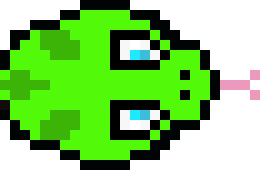

# Game project 1

## Descripción

Controlar una serpiente que tiene que comer las manzanas, evitando que sea cazada por las aguilas.

---

## Tabla de Contenidos

- [Características](#características)
- [Uso](#uso)
- [Controles](#controles)

## Características

- Movimiento de la serpiente controlado por teclado.
- Generación aleatoria de comida.
- Sistema de puntuación.

## Controles

- **Flecha arriba**: Mover hacia arriba.
- **Flecha abajo**: Mover hacia abajo.
- **Flecha izquierda**: Mover hacia la izquierda.
- **Flecha derecha**: Mover hacia la derecha.

